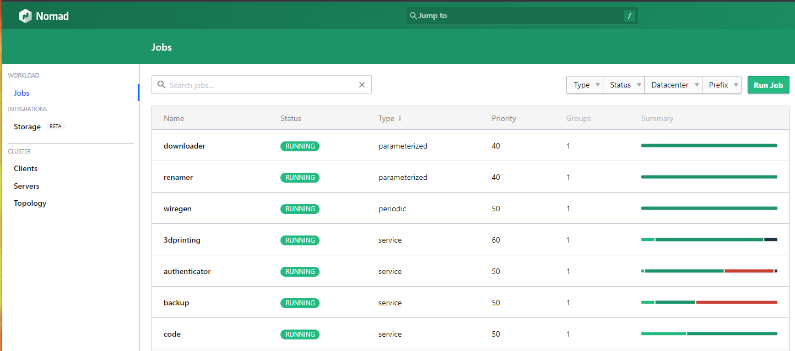
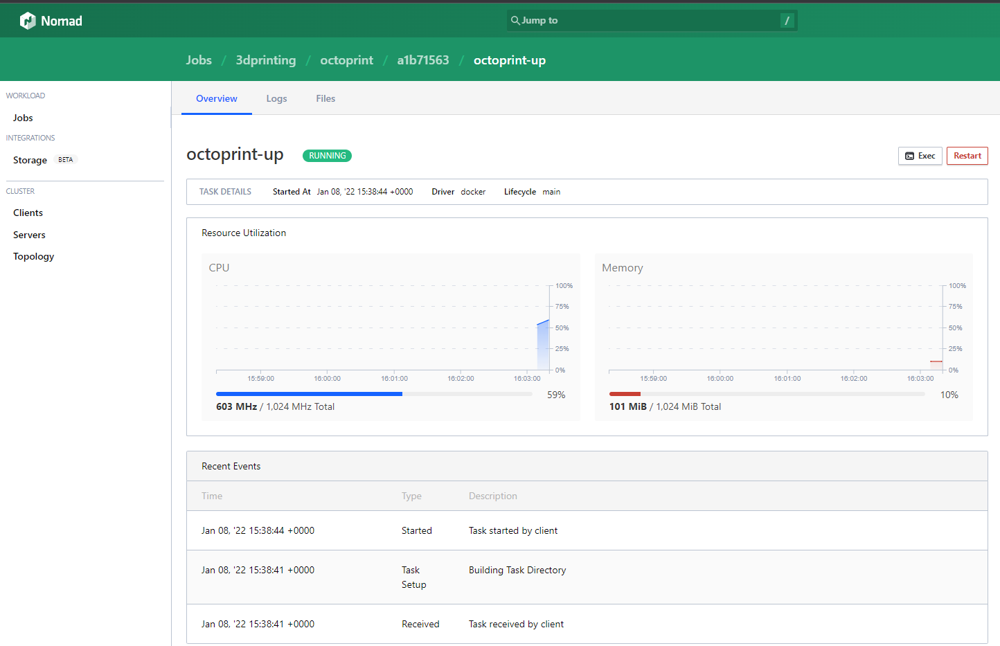
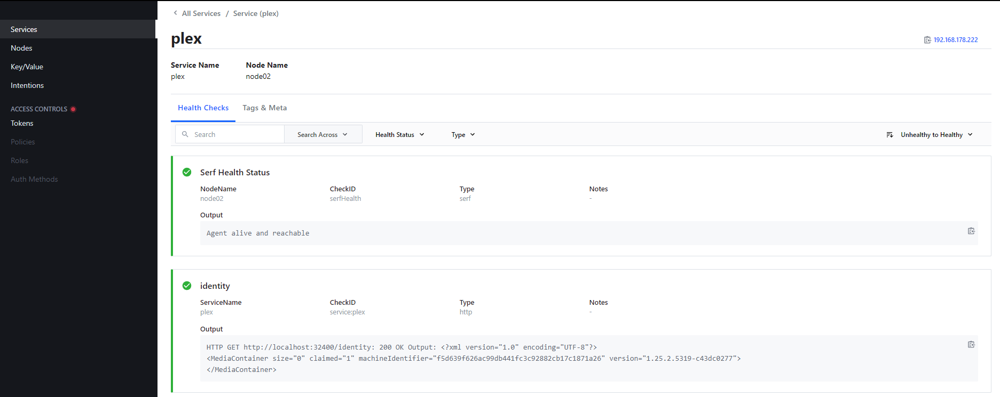
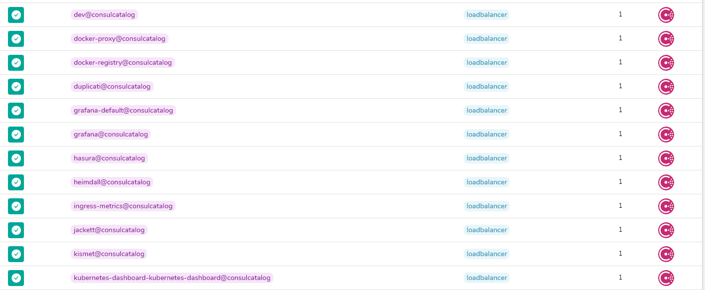
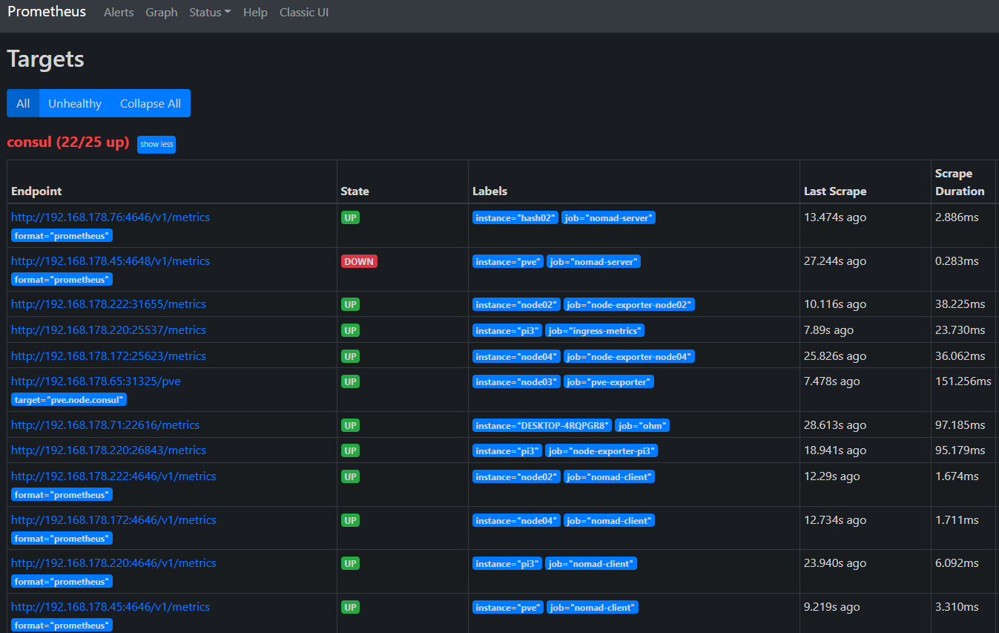
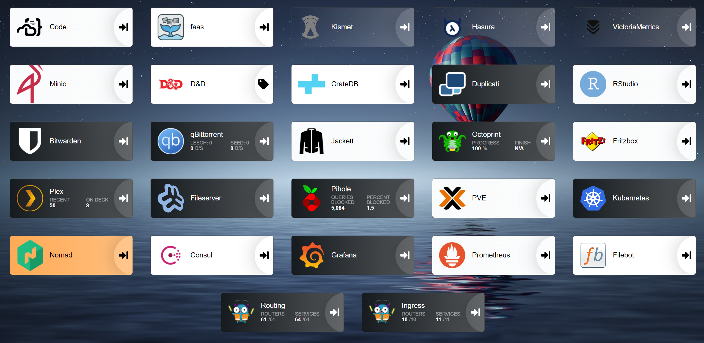

# Homelab Overview

Originally I bought a Raspberry Pi so I could run a home media centre. [Kodi](https://kodi.tv/), if you ever heard of it. I had a 1 Tb HDD drive filled with _totally legally acquired media files_ connected up to it. This was great and all, but I wanted to download more _totally legal media_. I installed a torrent client and started pulling down _The Wire_.

The RPi would quickly get hot and bothered if I was watching a 1080p video as well as downloading, so I bought another Pi. Then I set up Docker Swarm, then more Pis were purchased, then I started wonder "what if I could do X with this?" and so on and so forth...

The current inventory is a bit of a mishmash, but everything has a purpose.

### Compute

* 1 x Raspberry Pi 3 (1 GB)
* 3 x Raspberry Pi 4 (4 GB)
* 1 x Raspberry Pi 4 (8 GB)
* Lenova Legion Desktop
    * i7-10700 CPU @ 2.90GHz
    * 16 GB of ram expanded to 48 GB
    * Nvidia GTX 2060
    * 2 x 1 TB NVME
    * 2 x 6 TB HDD

### Other Bits 

* (Aging) Microsoft Surface Laptop
* Creality Ender 3 v2 3D printer
* Chromecast with Google TV
* Fritzbox Router supplied by digiweb
* Netgear 4 port switch
* Phones, tablets, smart light bulbs etc

The Pis are the core of the system, I've gone through several iterations of OS and Docker management.

* Rasbian
* Ubuntu
* Alpine
* k3OS
* Debian Bullseye x64 (Current)

* Docker managed with ansible / portainer
* Docker Swarm
* Kubernetes
* K3OS Kubernetes
* Nomad (Current)

## Virtualization with Proxmox

Raspberry Pis are versatile and relatively cheap, they lack any serious _Oomph_. And while the catalog is growing quickly, there is some software which is not available in ARM flavour. I wanted oomph and AMD64 capabilities. The original plan was to purchase either an SBC (Single Board Computer) from the likes of [UUDO](https://www.udoo.org/), or an SFFC (Small Form Factor Computer) like the [Intel NUC](https://www.intel.com/content/www/us/en/products/details/nuc.html). By the midpoint of the pandemic finding stockists for either of these, or anything similar, was impossible. Another plan that was nixed by the pandemic was building a PC. Nothing bananas powerful, something to play last generation games on, but buying a graphics card would cost me a kidney.

After a bit of shopping around the _least shit_ option was a mid tier Lenova. Is's a bit plasticky but the thermals are decent enough. After a few months it turns out that I didn't want to play games as much as I thought I did. I started to toy with the idea of installing linux on it and joining it to the cluster. But I still wanted to be able to play the odd game or do a bit of Photoshop occasionally. Dual Booting? No. Pain in the arse. I started looking into virtualizing Windows and passing through the GPU. I found several posts on Reddit detailing [GPU passthrough on Proxmox](https://www.reddit.com/r/homelab/comments/b5xpua/the_ultimate_beginners_guide_to_gpu_passthrough/).

TL;DR, it worked! I beefed it up with extra drives and RAM and I now had computer that performed ~~three~~ four functions

* Windows gaming / workstation
* Network Attached Storage
* Virtual Machine Platform
* Space Heater for my office.

Proxmox is awesome, has tonnes of features and most importantly; _free_. By default it runs two workload types, kernel virtualization with Qemu and OS containerization with LXC. It has a decent web UI, a well thought out API and  providers / modules are available for [Terraform](https://registry.terraform.io/providers/Telmate/proxmox/latest/docs) and [Ansible](https://docs.ansible.com/ansible/latest/collections/community/general/proxmox_module.html).

As a rule of thumb I tend to run dockerized workloads in VMs and everything else in LXC. LXC has an advantage over VMs of being able to bind to a directory on the host similar to docker, which is preferable for stateful tasks that need direct access to storage such as databases and media streaming. 

## Cloud Compute

I've gotten pretty good at harvesting CGP and AWS "always free" services, but I'll avoid giving them a penny out of my own pocket. Suck it Bezos! Occasionally I'll need some cloud compute in which case I'll spin up an instance on [Hetzner Cloud](https://www.hetzner.com/cloud).

## Workload Schedulers Or _What the f**k is Nomad and why aren't you using Kubernetes?_

Brace yourself for a tangent / rant!

Kubernetes is without doubt the champion of large scale workload orchestration.

* Multicloud / Hybrid
* Hyperscaling
* Tight integration with developer workflows via GitOps
* Loads of other good stuff

Now here is the controversial opinion; At scales below "huge" kubernetes is a [black hole of time](https://www.theregister.com/2021/06/29/kubernetes_spend_report/).
This is doubly true in a SysOps / DevOps setting, where your deploying a large amount of stateful, single image stacks with a fixed and/or low amount of instances.

If I was building the next Tinder for global deployment, and I had a building of agile developers pushing to prod, it would be Kubernetes. All. The. Way. At smaller scales you end up spending more time managing (and understanding) Kubernetes then deploying services to it. This is painfully apparent at the micro scale, where you have limited time and hardware. You want to be watching _The Wire_ on your time off, not configuring ingress controllers and persistent volume claims so you can eventually watch _The Wire_.

So Kubernetes was too much of a chore, and Docker Swarm is dying a slow death, what are the other options? A few years in VFX and Animation had brought me into contact with other types of workload schedulers such as [Deadline](https://www.awsthinkbox.com/deadline), [Qube!](https://www.pipelinefx.com/) and [OpenCue](https://www.opencue.io/). These are queue based schedulers used to distribute rendering tasks across a cluster of nodes. There is usually an agent of some sort running on each node, an orchestrator backed by a database that distributes tasks, and a (fugly/clunky) management interface.

Under the hood tasks are just shell commands with the usual args and flags appended. This made them quite flexible. Normally there would be several different classes of node. Racked servers, desktops, Windows, Linux, Macs, and more often than not, some cloud capacity. Nodes would be placed groups, and tasks would be restricted only to run in particular groups.

What I wanted was a workload scheduler that combined container orchestration with the ability to run generic command line tasks on a mix of Windows, Linux, ARM and AMD hosts. I was shocked to find that a solution existed in the form of [Hashicorp Nomad](https://www.nomadproject.io/).

> *A simple and flexible scheduler and workload orchestrator to deploy and manage containers and non-containerized applications across on-prem and clouds at scale.*

Nomad is a single agent binary that ticks all the boxes (Windows, Linux, Mac ARM, AMD) that will natively run several different task types

* Docker / Podman
* Isolated Fork / Exec
* Java 
* Qemu
* Raw Fork / Exec

The list is further expanded by [community developed plugins](https://www.nomadproject.io/plugins/drivers/community).

A Nomad Cluster has several characteristics that you'd recognize from Kubernetes or Swarm

* Agents can run as server or worker.
* Server form a quorum and elect a Cluster Leader.
* Servers dispense tasks, track health, etc.
* Server can optionally execute tasks.

In production its advised to run between at least 3-5 dedicated (non task running) Servers. In the first iteration of my RPi Nomad cluster, 3 of the 5 Pis ran as task running Servers, giving some fault tolerance.

There are [four different job schedulers](https://www.nomadproject.io/docs/schedulers) available; `service`, `batch`, `system` and `sysbatch`. Service is the most commonly used, designed for long running tasks that should always be running.

Job definitions are written in [HCL2](https://www.nomadproject.io/docs/job-specification/hcl2), which will be familiar if you've worked with Terraform, Packer, or any other Hashicorp product. Initially this was a bit of a turn off. *Why can't they just use YAML like everyone else?* After a week or so of use I started to see the advantages in an actual configuration *language*. HCL has some built in functions that DRY out the files and allow for some neat tricks with dynamic deployments.

There is a built in management web UI, which isn't going to win any beauty contests, but is akin to Portainer or the stock Kubernetes dashboard.

 

Compared to Kubernetes and Swarm, Nomad Clusters are a looser organization of individual hosts. Out of the box, there is no networking layer that is a prominent part of Docker orchestrators. There are pros and cons with this. There isn't the "inside the cluster" vs "outside the cluster" distinction. Swarm and Kubernetes networks provide an extra layer of security for limiting access to containers, you dont have to totally nail down access to a containerized database for example.

The big plus of Nomad Cluster is that workloads don't *require* containerization. Existing legacy services and hosts can leverage the advantages of a multi-host orchestration system and be managed side by side with dockerized workloads.

Now you're probably thinking this is neat and all, but not really enough to convince you to ditch Swarm or Kubernetes. it's the tight integration with Consul, another Hashicorp product, that makes it a serious contender. 

## Service Discovery Or _Where's my S**t?_

**Story Time**. Back when I had 1 Raspberry Pi with 2 or 3 docker containers life was simple, there was 1 IP and a few port numbers I had to remember, but nothing onerous. I got more Pis and Swarmed them together. I still had only one IP to worry about but the ports were starting to add up, I was relying on the history in my browser to remember them all. More containers and more ports and eventually I added in an NGINX container, as was the fashion at the time.

This was *OK* but path based based is a pain, containers mostly assume they are being served from `/`. I'm spending more and more time adding path routes, rebuilding the container image, troubleshooting and staring at the NGINX 404 and 502 pages. If the NGINX container took a header your boned. Or the particular host it was on went down, you end up hunting around the remaining Pis to see where it was rescheduled to. You can constrain NGINX to single host, but once again, if it goes down your going to spend the evening staring at a terminal instead of watching _The Outer Limits_.

I came upon traefik and it's a game changer. NGINX goes in the bin. Path based routing is swapped out for Host based routing. Now I have to update the DNS records on my crappy router all the time. I set up the lone Raspberry Pi 3 as a dnsmasq server. This is _slightly_ better, at least it can be automated. I have a whole ci pipeline set up to validate and push configs out to the Pi and reload dnsmasq, its laborious but it works. So everything in the house is going through dnsmasq now. If there is a screw up everything in the house stops working.

I wanted something like Traefik, but for DNS. I wanted containerized services to register themselves and be resolvable outside the cluster. Once I figured out what I was looking for I found [Consul](https://www.consul.io/).

While Consul integrates tightly with Nomad, as well as Kubernetes and AWS ECS, it works as a standalone service. There is a command line utility and an API that can be used to register and deregister services, as well as to query the health, state  and location of registered services. These are assigned an address in the format of `<service name>.service.consul ` for example `prometheus.service.consul`. By default it exposes a DNS server on port `8600` that will return the location of a given service.

```term
root@pve:~# dig prometheus.service.consul @127.0.0.1 -p 8600

; <<>> DiG 9.16.15-Debian <<>> prometheus.service.consul @127.0.0.1 -p 8600
;; global options: +cmd
;; Got answer:
;; ->>HEADER<<- opcode: QUERY, status: NOERROR, id: 40441
;; flags: qr aa rd; QUERY: 1, ANSWER: 1, AUTHORITY: 0, ADDITIONAL: 1
;; WARNING: recursion requested but not available

;; OPT PSEUDOSECTION:
; EDNS: version: 0, flags:; udp: 4096
;; QUESTION SECTION:
;prometheus.service.consul.     IN      A

;; ANSWER SECTION:
prometheus.service.consul. 0    IN      A       192.168.178.172

;; Query time: 3 msec
;; SERVER: 127.0.0.1#8600(127.0.0.1)
;; WHEN: Sat Jan 29 18:55:09 GMT 2022
;; MSG SIZE  rcvd: 70
```

Consul acts as a load balancer if there are multiple locations registered to the same service

```term
root@pve:~# dig nomad-client.service.consul @127.0.0.1 -p 8600

; <<>> DiG 9.16.15-Debian <<>> nomad-client.service.consul @127.0.0.1 -p 8600
;; global options: +cmd
;; Got answer:
;; ->>HEADER<<- opcode: QUERY, status: NOERROR, id: 56758
;; flags: qr aa rd; QUERY: 1, ANSWER: 9, AUTHORITY: 0, ADDITIONAL: 1
;; WARNING: recursion requested but not available

;; OPT PSEUDOSECTION:
; EDNS: version: 0, flags:; udp: 4096
;; QUESTION SECTION:
;nomad-client.service.consul.   IN      A

;; ANSWER SECTION:
nomad-client.service.consul. 0  IN      A       192.168.178.220
nomad-client.service.consul. 0  IN      A       192.168.178.71
nomad-client.service.consul. 0  IN      A       192.168.178.65
nomad-client.service.consul. 0  IN      A       192.168.178.222
nomad-client.service.consul. 0  IN      A       192.168.178.166
nomad-client.service.consul. 0  IN      A       192.168.178.45
nomad-client.service.consul. 0  IN      A       192.168.178.172
nomad-client.service.consul. 0  IN      A       172.17.0.1
nomad-client.service.consul. 0  IN      A       192.168.178.153

;; Query time: 0 msec
;; SERVER: 127.0.0.1#8600(127.0.0.1)
;; WHEN: Sat Jan 29 18:58:08 GMT 2022
;; MSG SIZE  rcvd: 200
```

Consul follows a similar architecture to Nomad

* Single agent binary that runs as server or client.
* Servers elect a Leader.
* In built web UI.

As well as host location, health checks can be registered for a particular service. If the service checks fails Consul flags it in the catalog and a DNS query will return `NXDOMAIN`.



On any host running Consul a service definition file can be dropped into `/etc/consul.d/`. The local agent will communicate this to the rest of the cluster.

```hcl
services {
  name = "proxmox"
  tags = [
    "traefik.enable=true",
    "traefik.http.routers.proxmox.rule=Host(`proxmox.service.consul`)",
    "traefik.http.services.proxmox.loadbalancer.server.scheme=https"
  ]
  port = 8006

  checks = [
    {
      name = "http ui"
      http = "https://localhost:8006"
      tls_skip_verify = true,
      method   = "GET"
      interval = "30s"
      timeout  = "5s"
    }  
  ]
}
```

```hcl
services {
  name = "postgres"

  tags = [
  ]

  port = 5432

  checks = [
    {
      name = "postgres is ready"
      args = ["/usr/bin/pg_isready", "-h", "localhost", "-p", "5432"]
      interval = "30s"
      timeout = "1s"
    }
  ]
}
```

If you are using Nomad (or Kubernetes) to manage workloads, service registration and deregistration is an automated process.

Consul can be used as a Service Discovery Backend for [Traefik](https://doc.traefik.io/traefik/v2.1/routing/providers/consul-catalog/) that can be controlled through the use of tags, the same as Docker



This is also true for [Promethues](https://prometheus.io/docs/prometheus/latest/configuration/configuration/#consul_sd_config)



But wait! Consul has other tricks up its sleave. The [Key Value Store](https://www.consul.io/docs/dynamic-app-config/kv), which is endlessly useful in conjunction with Nomad and Ansible. Access to services can be controlled through the use of [intentions](https://www.consul.io/docs/connect/intentions), this is Access Control decoupled from the host. The [Connect Service Mesh](https://www.consul.io/docs/connect) is similar to the Docker networking / routing mesh. This can be used on its own or coupled with Nomad or Kubernetes, and has first class support for [Envoy](https://www.envoyproxy.io/).

## Putting It All Together

So how does this rabble of computers all fit together? The current incarnation is this:

### PVE (pve.lan)

* Virtualisation Environment running VM and LXC guests
* Stateful workloads
* NFS and Samba services
* Nomad Server
* Consul Server

VIP Guests:

* LXC fileserver for NFS and Samba
* Two LXC containers `hash1` and `hash2`running Nomad and Consul Servers

### pi0.lan

* DNS / DHCP using [Pi-Hole](https://pi-hole.net/)
* Consul Client

### pi1.lan, pi2.lan, pi3.lan, pi4.lan

* Nomad Client
* Consul Client
* Docker

## Worker Bootstrapping

* Basic configuration is done with Ansible.
* No static networking.
* All new hosts (LXC, VM, Bare metal) have a Consul and Nomad Client installed.
* _Most_ hosts have Docker installed.

The only other default packages are `nfs-utils` and the [Unbound DNS Resolver](https://www.nlnetlabs.nl/projects/unbound/about/). Everything else is deployed and manage via Nomad.

## DNS and Service Discovery


New, healthy, services registered with Consul are immediately resolvable network wide.

Queries to `*.consul` are directed to the local Consul agent listening on `8600` using Unbound

```ini
# Allow insecure queries to local resolvers
server:
  do-not-query-localhost: no
  domain-insecure: "consul"

#Add consul as a stub-zone
stub-zone:
  name: "consul"
  stub-addr: 127.0.0.1@8600
```
This prevents the Pihole DNS server from being swamped by requests from the likes of Prometheus.

## HTTP Routing

All nodes hosting http services run an instance of Traefik deployed as a [Nomad System Job](https://www.nomadproject.io/docs/schedulers#system).

Traefik uses Consul for service discovery and to configure routing rules for all services, Dockerized or not.

There are two Traefik "Lanes" configured.


The internal `routing` lane, and an `ingress` lane for requests from the public internet. This configuration is mostly a consequence of having a domestic router. But it does have the benefit of preventing services accidentally leaking onto the internet due to misconfiguration.

### Routing Lane

Private service configuration requires a minimal configuration.

```hcl
    network {
      port "http" {
        to = 5452
      }
    }

    service {
      name = "filebot"
      port = "http"

      tags = [
        "routing.enable=true",
        "routing.http.routers.filebot.rule=Host(`filebot.service.consul`)",
      ]
    }
```

### Ingress Lane

Publicly available services have a second ingress configuration which has bells and whistles such as Lets Encrypt SSL and forward auth. Throttling, allowlists and any other traefik rule can be applied to ingress without impacting requesting from inside the network 

```hcl
    network {
      port registry {
        to = 5000
      }
    }

    service {
      name = "docker-registry"
      port = "registry"

      tags = [
        // routing
        "routing.enable=true",
        "routing.http.routers.docker-registry.rule=Host(`docker-registry.service.consul`)",

        // ingress
        "ingress.enable=true",
        "ingress.http.routers.docker-registry.entrypoints=websecure",
        "ingress.http.routers.docker-registry.tls=true",
        "ingress.http.routers.docker-registry.tls.certresolver=cloudflare",
        "ingress.http.routers.docker-registry.rule=Host(`registry.shiveringjimmy.com`)",
      ]
    }
```

### Cloudflare

God send! Cloudflare offer tonnes on the free tier.

* DNS proxying
* Reverse tunnels
* Geo blocking
* Traefik integration
* Loads of good stuff

## Monitoring And Observability

It should come as no surprise that I'm generating logs and metrics out the wazoo. I'm on my fourth monitoring stack at this point.

### Metrics

The current set up is, or course, Prometheus centered. Everything that can expose an endpoint is pumping out reams of data.

* Node exporter for Linux
* Ohm for Windows
* Docker
* Nomad
* Consul
* Proxmox
* Pi-hole
* Fritzbox router metrics

All metrics are retained for 30 days. In addition I have Promscale / [TimescaleDB](https://www.timescale.com/) (Postgresql) as long term storage for certain key metrics and aggregations.

### Logging

Boy, this has been an adventure. I ran an ELK stack but it was waaay to much like my day job. Elasticsearch in a homelab has all the drawbacks of regular Elasticsearch except it eats all available resources.

I'm currently running [Loki](https://grafana.com/oss/loki/), which IMO is a mixed bag. It's like Prometheus, sort of.. Currently its sucking in logs from the Nomad deployments. I'm not hugely impressed by Promtail, I'm probably going to swap it out for Fluentbit / Fluentd

### Tracing

This is the next part of the observability puzzle. Zipkin, Jaeger or the Open Telemetry Collector? Traces will become pertinent as I write and deploy more of my own applications and rebuild the Kubernetes cluster. Until then it's more of a curiosity.

### Graphing and Visualization.

Grafana, of course, and Power Bi. This is where having metrics in TimescaleDB / Postgresql become indispensable. I've started doing some basic visualizations in Tableau, but as with Power Bi you need deep pockets. I have a [Dockerized RStudio](https://support.rstudio.com/hc/en-us/articles/200552306-Getting-Started) development environment running with the intention to deploy a [Shiny App](https://shiny.rstudio.com/).

### Alerting

This is still `TODO`. I'm not sure if it's necessary. I can tell if something is going wrong by the drive and fan activity on the Proxmox host, the status leds on the Pis or Alexa freaking out.

## Deployed Applications

So I have all this infrastructure, workload orchestration, service discovery, routing and monitoring, what do I do with it?

Its main function is stil a media aggregation, organization and Video on Demand platform. It's come a long way from a Pi running Kodi hanging off the back of the tv. Currently I have about 4tb of Scifi that streams straight to the Chromecast, or any other point on the planet that has an internet connection.


More importantly, it's an actual home laboratory and extended development environment. Any new piece of cool software I stumble on I can generally have up and running in 10 minutes.



## Whats Next

Kubernetes, again. I won't be replacing Nomad and Consul anytime soon, but there are certain workloads and integrations where Kubernetes is a prerequisite. I have Ansible bootstrapping a [K3OS](https://k3os.io/) cluster on Proxmox and joined to Consul.

Vault, again. I had a stab at it a year ago but never got it over the line.

Web Application development. In a previous life I was a front end developer! I'm currently building a `Hello World!` CRUD App in Sveltekit on top of GRAPHQL.

